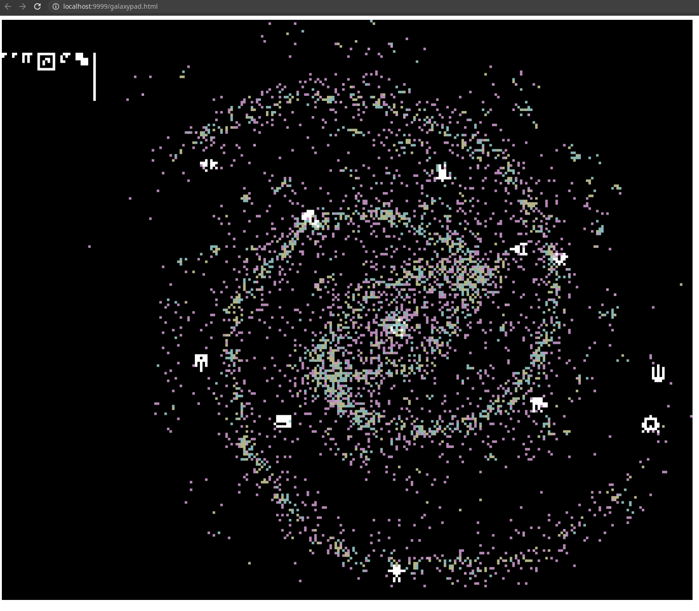

# ICFP Programming Contest 2020

Team `hayatox`'s repository for
[ICFP Programming Contest 2020](https://icfpcontest2020.github.io/).

# Members:

- Hayato Ito (hayato@google.com)

# Programming Launguages

- Rust

# How to play; explore the galaxy

Overview:

```
Browser <--( HTTP )--> Galaxy Evaluater <--( HTTP )--> Alien Proxy <--( unknown )--> Galaxy
```

1. Prerequirements

   The repository doesn't contain apikey. You need your own apikey.

   ```shellsession
   echo YOURAPIKEY > ./task/apikey
   ```

2. Run Galaxy Evaluater, which also runs the web server to interact with the
   galaxy.

   ```shellsession
   make interact
   ```

   This runs `cargo run --release --bin app interact` with some configutations.
   See [`Makefile`](./Makefile) for the detail.

3. Open `http://localhost:9999/gamepad.html` in your browser. You will see a
   _clickable_ galaxy map as a starting point, like the following:

   

4. Keep clicking a pixel to explore the galaxy.
